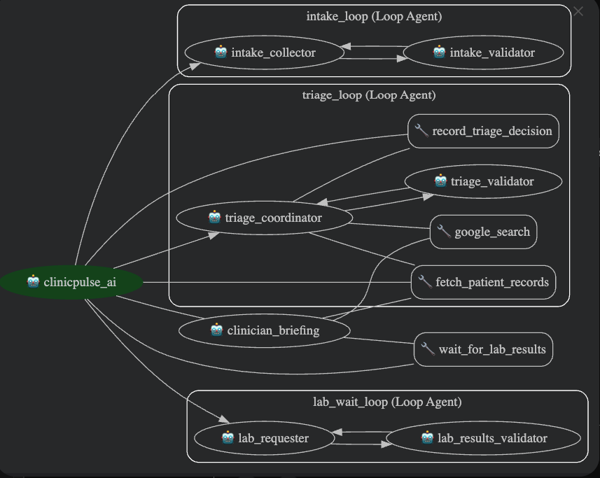

# ClinicPulse AI – Kaggle Agents Capstone Submission

**Track:** Agents for Good  
**Subtitle:** Smart clinic flow manager that triages, pauses for labs, and briefs clinicians with complete patient context.

## 1. Problem & Value

Outpatient clinics still rely on clipboards, phone calls, and scattered notes. Patients repeat the same information to front desk staff, nurses, and physicians. Critical vitals or labs are often missing when the clinician walks in, creating delays, safety risks, and burnout. ClinicPulse AI reduces this friction by orchestrating intake, triage, lab follow-ups, and doctor briefings through a multi-agent workflow that writes to a shared patient dossier. Clinicians get a structured briefing, patients spend less time waiting, and clinics can handle higher throughput without hiring additional staff.

## 2. Solution Overview

ClinicPulse AI is built with Google Agent Development Kit (ADK). The orchestrator agent manages a set of specialized LoopAgents:

1. **Intake Agent** – Collects demographics, symptoms, duration, and relevant history until validation passes.
2. **Triage Agent** – Uses Google Search + custom EHR tools to prioritize the visit and log rationale.
3. **Lab Wait Agent** – Demonstrates long-running operations by pausing the workflow until lab results are provided and validated.
4. **Clinician Briefing Agent** – Produces a Markdown dossier (Overview, Vitals, Risk, Next Steps) with recommended questions for the doctor.

All agents read/write to shared ADK session state; observability hooks record structured logs for compliance audits. A rubric-based evaluator ensures final briefings meet a minimum quality bar.

## 3. Capstone Feature Coverage

| Feature Requirement | Implementation Detail |
| --- | --- |
| Multi-agent system | Sequential pipeline of LoopAgents (`intake_loop`, `triage_loop`, `lab_wait_loop`) plus the `clinician_briefing` agent orchestrated in `clinicpulse/agent.py`. |
| Tools | Combination of built-in Google Search and custom FunctionTools (`fetch_patient_records`, `record_triage_decision`, `wait_for_lab_results`). |
| Long-running operations | `lab_wait_loop` holds the conversation until `lab_results` are available; `wait_for_lab_results` tool signals pauses/resume. |
| Sessions & Memory | `InMemorySessionService` keeps shared state keys (`patient_intake`, `triage_priority`, `lab_results`, `clinician_briefing`). |
| Observability | `clinicpulse/logging_utils.py` captures structured logs with optional `CLINICPULSE_LOG_LEVEL`. Tools and validators emit telemetry for each step. |
| Agent evaluation | `eval/evaluate_briefing.py` scores generated dossiers on structure, clinical completeness, and safety awareness before delivery. |

## 4. Architecture Diagram



```
                         ┌───────────────────────────────────────────┐
                         │           clinicpulse_ai (root)           │
                         │   Orchestrator / entry Agent              │
                         └───────────────────────────────────────────┘
                                           │
                                           │ user session
                                           ▼
┌─────────────────────────────────────────────────────────────────────────────┐
│                        intake_loop  (Loop Agent)                            │
│                                                                             │
│   ┌─────────────────────────────┐          ┌─────────────────────────────┐  │
│   │   intake_collector          │ ───────► │    intake_validator         │  │
│   │   - asks questions          │          │    - checks dossier fields  │  │
│   │   - updates patient dossier │ ◄─────── │    - returns missing items  │  │
│   └─────────────────────────────┘          └─────────────────────────────┘  │
│                                                                             │
│     loop until: demographics + chief complaint + onset + severity complete  │
└─────────────────────────────────────────────────────────────────────────────┘
                                           │
                                           │ dossier complete
                                           ▼
┌─────────────────────────────────────────────────────────────────────────────┐
│                         triage_loop  (Loop Agent)                           │
│                                                                             │
│   ┌─────────────────────────────┐                                           │
│   │     triage_coordinator      │                                           │
│   │   - reads dossier           │                                           │
│   │   - calls tools / validator │                                           │
│   └─────────────────────────────┘                                           │
│                     │                                ▲                      │
│                     │ calls                          │ feedback             │
│                     ▼                                │                      │
│           ┌───────────────────────────┐              │                      │
│           │     triage_validator      │              │                      │
│           │  - checks safety &        │──────────────┘                      │
│           │    completeness           │      loop until triage decision ok  │
│           └───────────────────────────┘                                     │
│                                                                             │
│   External tools used by triage_coordinator:                                │
│                                                                             │
│      ┌────────────────────┐       ┌────────────────────┐                    │
│      │ record_triage_     │       │   google_search    │                    │
│      │ decision           │       │ - guideline lookup │                    │
│      │ - log priority     │       └────────────────────┘                    │
│      └────────────────────┘                     ▲                           │
│                     ▲                          /                            │
│                     │ calls                   /                             │
│                     ▼                        /                              │
│      ┌────────────────────────┐             /                               │
│      │  fetch_patient_records │◄───────────                                │
│      │  - mocked EHR tool     │                                             │
│      └────────────────────────┘                                             │
└─────────────────────────────────────────────────────────────────────────────┘
                                           │
                                           │ triage complete
                                           ▼
┌─────────────────────────────────────────────────────────────────────────────┐
│                         clinician_briefing (Agent)                          │
│                                                                             │
│   - reads full patient dossier                                              │
│   - synthesizes:                                                            │
│        • summary                                                            │
│        • problem list                                                       │
│        • suggested clinician questions                                      │
│        • suggested next steps / orders                                      │
│                                                                             │
│   Optional long-running wait:                                               │
│                                                                             │
│      ┌──────────────────────────────┐                                       │
│      │   wait_for_lab_results      │                                        │
│      │   - tool to simulate        │                                        │
│      │     pause/resume on labs    │                                        │
│      └──────────────────────────────┘                                       │
└─────────────────────────────────────────────────────────────────────────────┘
```

## 5. Technical Highlights

- **Configuration** – `clinicpulse/config.py` handles Vertex AI vs. AI Studio credentials with fallbacks to avoid ADC crashes.
- **Observability** – Custom logger ensures every tool call and validator escalation is tracked (`clinicpulse/tools.py`, `clinicpulse/validation/checkers.py`).
- **Evaluation** – Rubric script (`eval/evaluate_briefing.py`) delivers JSON scores so teams can automate QA or CI gating.
- **Documentation** – `README.md` covers installation, ADK web usage, evaluation flow, and logging configuration.

## 6. Running the Project

```bash
python -m venv .venv
source .venv/bin/activate
pip install -r requirements.txt
cp .env .env.local  # fill in your credentials
adk web             # or run python -m tests.test_agent
```

To score a generated dossier:

```bash
python -m eval.evaluate_briefing --file path/to/briefing.md
```

## 7. Evaluation & Metrics

- **Structure Clarity** – Ensures the agent uses consistent headings (Overview, Vitals, Risk, Next Steps).
- **Clinical Completeness** – Confirms vitals, symptoms, history, and next steps are referenced.
- **Safety Awareness** – Flags whether risk language, escalation guidance, or follow-ups are present.

These metrics can be extended with automated prompts (e.g., model graders) in future iterations.

## 8. Future Enhancements

- Persistent memory bank to recall multi-visit histories.
- Metrics export (e.g., OpenTelemetry) and dashboards for ops teams.
- Deployment on Agent Engine or Cloud Run for managed hosting.
- Optional A2A protocol layer to notify downstream systems (EHR, paging) when critical triage flags appear.

## 9. Repository Links

- **GitHub:** *(replace with final public repository URL when submitting)*
- **Demo Video (Optional):** *(add YouTube link if produced for bonus points)*

ClinicPulse AI demonstrates how multi-agent workflows, observability, and pause/resume operations can make clinical intake safer, faster, and more consistent—fulfilling the Agents for Good track mission.
